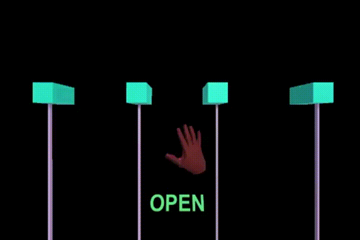

<h3> &#x1F4D8; &nbsp;&nbsp;Hi, my name is Ivo Stinghen and welcome to my "Final Paper - Part I - Unity Side - LeapMotion" repository!
 
<h4>(Trabalho de Conlusão de Curso - UFAM) </h3>
<h4>&#x1F537;&nbsp;&nbsp;Note:This is a free, open source repository, so fell free to download it and contact me for any questions.

<h4>What is the main structures used here?

- Unity Engine
- C#
- Leap Motion Plugin
- Leap Motion Sensor Hardware

<h4>What you can do inside this project?

- Generate a hand gesture database
    <h5>- Required for python classifier in Final Paper - PartII - Python Side - MachineLearning. 
    <h6> &nbsp   Link of Part II : https://github.com/ivostinghen/PythonML

- Receive real-time hand-gestures preditions: 
    <h5> Open a communication to python socket
    <h5> Receive prediction in real-time from python side classifier
    <h5>- OBS: You must have pre-trained your python classifier

<h4>Real-time gesture prediction gameplay in Unity Engine using Leap Motion Sensor
   <h3> Youtube Link: https://www.youtube.com/watch?v=tOIR6i9I7ws

